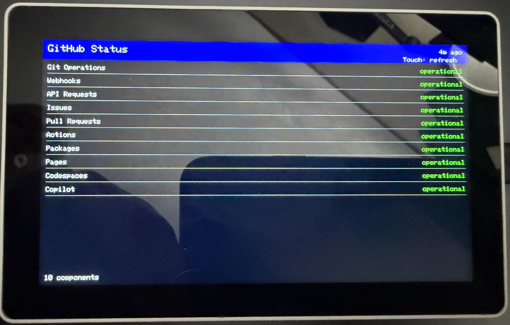

Displays current GitHub service status on the M5Stack Tab5. Status refreshes every 5 minutes or when the screen is touched.

Add your WiFi credentials to the source before compiling and uploading to the device:

```
// WiFi credentials
const char* ssid = "WIFISSID";
const char* password = "WIFIPASSWORD";
```

This project was created with the help of Claude Opus 4.1.



